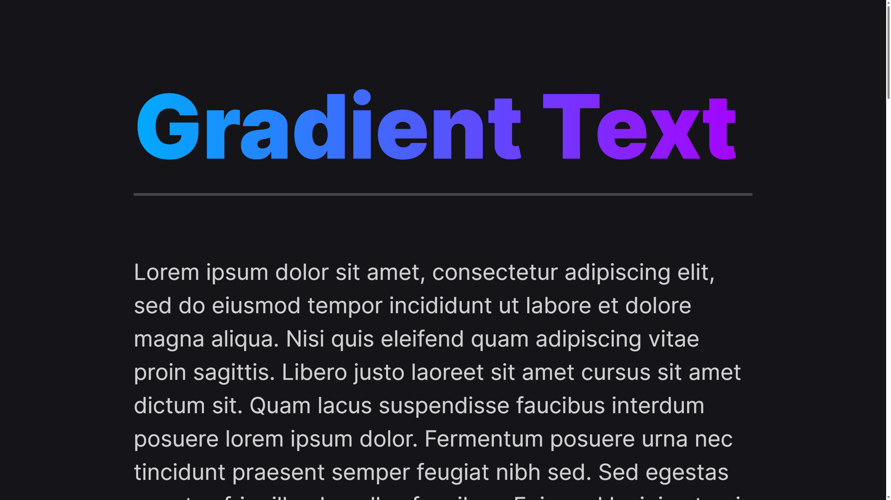

# Gradient Text

This is a snippet demonstraighting how to add a gradient to your text.

## HTML

```html
<h1 class="gradient-text">Gradient Text</h1>
```

## CSS

```css
.gradient-text {
  background: linear-gradient(90deg, #0af, #a0f);
  -webkit-background-clip: text;
  background-clip: text;
  -webkit-text-fill-color: transparent;
}
```

## Preview


